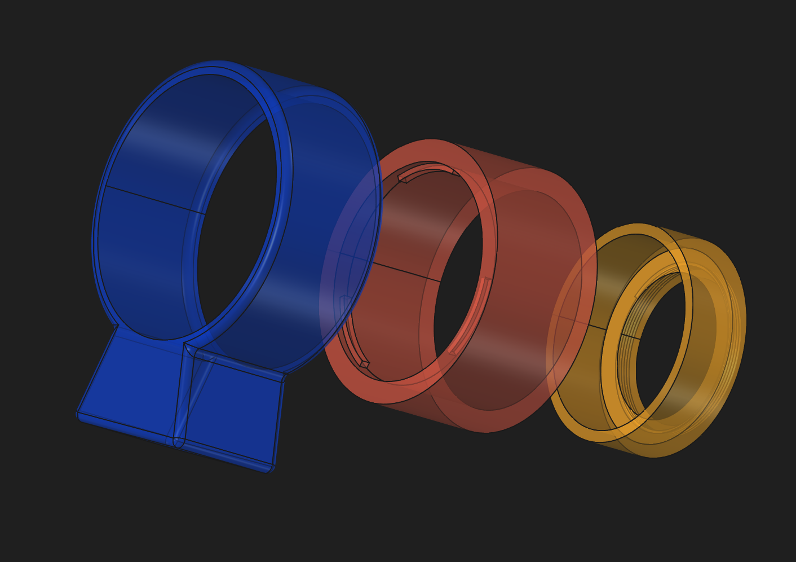
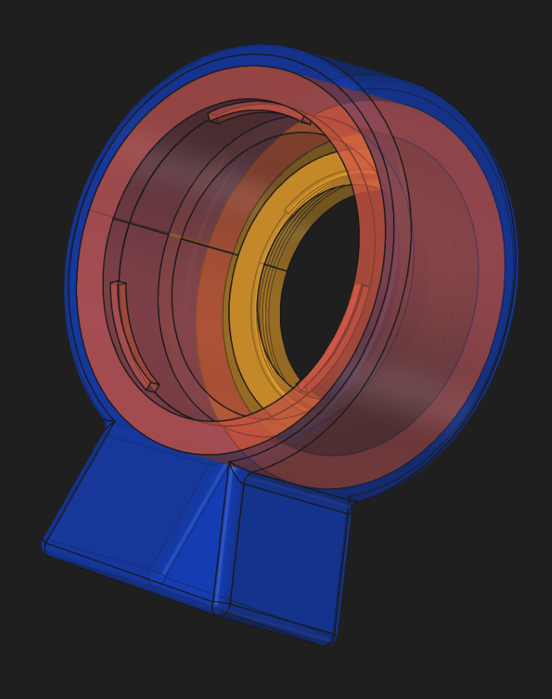
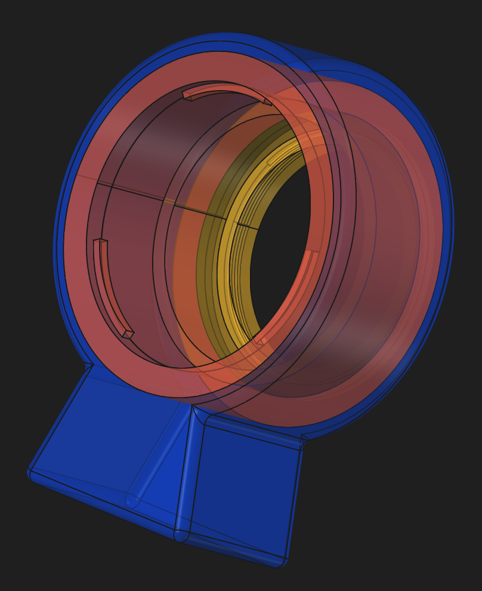

# Lens Cameras Adapters

Lens Cameras Adapters is a 3D astronomy project designed to enable the 3D printing of adapters that connect APN lenses to astrophotography cameras equipped with M42 (T2) or M48 threads.

## 🔭 Project purpose

This project provides a practical solution for attaching Canon EF lenses to astronomy cameras while preserving the required optical spacing between the lens and the camera sensor.

## 🔧 Main components

- **Lens connector**: adapts a Canon EF lens mount.
- **Camera connector**: available in M42 (T2) and M48 versions for compatibility with astrophotography cameras.
- **Mount bracket**: allows the assembled adapter to be attached to an astronomical mount.

## 📏 Optical requirement

The two main adapter parts are designed to maintain the correct distance of 44 mm between the lens and the camera sensor. This is required for cameras with a back focus of 12.5 mm.

## 🌌 Use case

This setup is intended for astrophotography applications where Canon EF lenses are used with cameras that require specific adapter spacing and thread compatibility.

## 🖼️ Screenshots

Illustration of the three-element mounting setup:

<table style="border-collapse: collapse; border: none;">
  <tr>
    <td style="border: none; text-align: center;"> <strong>Assembly M42</strong></td>
    <td style="border: none; text-align: center;"> <strong>Assembly M48</strong></td>
  </tr>
</table>

## 📁 Files included

The repository contains the main FreeCAD project file and the associated STEP files for the different connector and bracket components:

- [Canon_EF.FCStd](Canon_EF.FCStd) — FreeCAD project file
- [Canon_EF-Lens_connector.step](Canon_EF-Lens_connector.step) — Canon EF lens connector
- [Canon_EF-M48_connector.step](Canon_EF-M48_connector.step) — M48 camera connector
- [Canon_EF-T2_connector.step](Canon_EF-T2_connector.step) — T2/M42 camera connector
- [Canon_EF-Mount_bracket.step](Canon_EF-Mount_bracket.step) — astronomical mount bracket

## ⚠️ Disclaimer

These parts are assembled mainly by friction and mechanical fit. They are best suited for small astrophotography setups, such as compact lenses like the Sigma 17-70 mm and small planetary cameras such as the ZWO ASI224 or Player One Mars C II.

If a heavier camera is used, the system should be mechanically secured with a locking screw for the camera to prevent accidental slackening or detachment.
